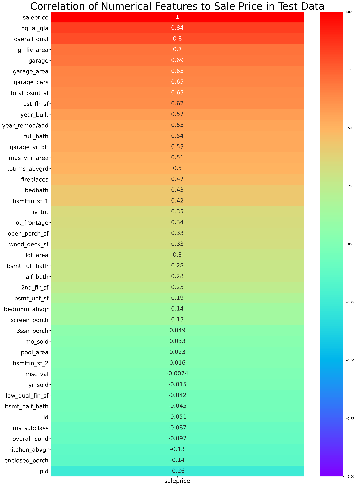
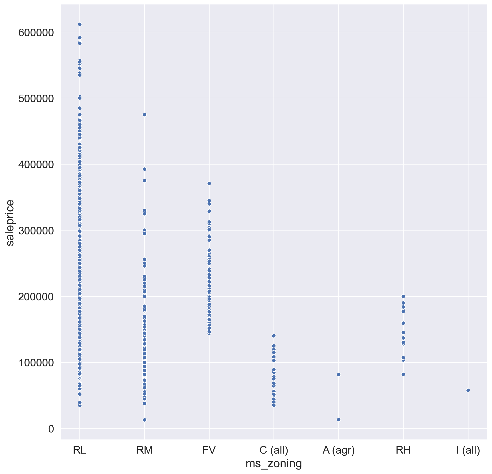
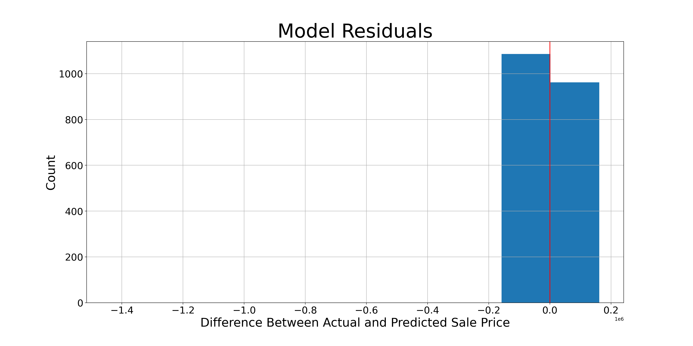

- [Problem Statement](#Problem-Statement)
- [Summary](#Summary)
- [Next Steps](#Next-Steps)
- [Data Dictionary](#Data-Dictionary)
- [External Resources](#External-Resources)

---

## Problem Statement

The Iowa Neighbor's Association of Homes (IOWANAHOME), a regional realty group, has hired my company to build a model to predict house sale prices in the town of Ames, Iowa. In the course of creating realty listings, IOWANAHOME collects 80 data points on each residence and they have provided me with historical data from their records to create and test my model. Specifically, thhave requested a model that predicts sale price in Ames with a focus on key categorical features and how zoning and/or geography may or may not affect home prices.

---

## Summary

My analysis began by examining numerical categories (nb link) a heatmap to evaluate correlation between the numerical features and the target, sale price. I initially chose the top 10 most correlated, and then filtered out 3 that were highly correlated with each other (example: garage area and number of cars that can fit in the garage). As I continued to refine my model, I added correlations above .4, and eventually those above .3 and saw the expected marginal gains at each iteration. This is a heatmap specifically of the aspects I chose to include:

Note: there are some additional engineered columns, like 'garage' which was a multiple of garage area (square footage) times garage cars (number of cars that fit in the garage). I found this to be a more accurate metric than either of those two individual scores, so I dropped them from my model and used my engineered metric instead.

In a separate notebook (nb link), I evaluated categorical features. After reading through the full data dictionary on kaggle (link), I selected those which appeared most promising and evaluated them one-by-one to see which had clear groupings in relation to sale price. Having checked value counts, pair plots, and other related metrics (depending on what the category was designed to measure), I made the necesary adjustments in my processing algorithm to include the features which displayed obvious patterns correlated to sale price. In most cases this involved grouping the different components of the features that appeared in similar price brackets into a new column in order to reduce my model's total number of columns and eliminate the possibility of mismatch between columns in training and test. Below is an example of zone sorted by price.

I also applied a logarithmic transformation to my sale price (y) value and then exponentiated it at the end - this reduced the differences between the outliers at the very top end of sale price so that my model had a more accurate fit. I wrote a function which I used repeatedly as I tried new combinations of features - it takes in three arguments - dataframe name, feature list, categorical feature list - and returns all the relevant metrics related to the quality of the model. Here is a display of the output for my best model:

Whenever I found a model that scored better than it's predecessors, I fed the same information that my make_model() function accepts into another function I wrote called save_test(). This function instantiates the model, prints my R2 score for the model, then loads in the test data, cleans the test data, and shows my the top five rows (head) of my potential submission dataframe. It then accepts an input command - "yes" or "no" and if I like what I see, I can enter "yes" and it will save the model named after the current timestamp, ensuring that I never accidentally overwrite a previously saved model. Jere is a table of the ten largest coefficients from my model - all of them were engineered.

| Feature Name         |     Description |   Model Coefficient |
|:---------------------|---------:|-----------:|
| ms_cat_ms3           | Floating Village Zone |   0.320036 |
| ms_cat_other         | Res Low Density Zone |   0.304347 |
| ms_cat_ms2           | Res High Density Zone |   0.298745 |
| ms_cat_ms4           | Res Medium Density Zone |   0.276961 |
| ex_cat_2             | Good/Excellent Exterior |   0.212645 |
| k_cat_3              | Excellent Kitchen |   0.192331 |
| h_cat_3              | Steam Heating |   0.186971 |
| h_cat_2              | Forced Air Heating |   0.182866 |
| ex_cat_1             | Typical/Average Exterior |   0.174848 |
| neighborhood_StoneBr | Stone Brook Neighborhood |   0.138507 |

In conclusion - this model is the best mixture of simplicity and refinement - it strategically includes the numerical and categorical features that correlate best with sale price, while simultaneously excluding extraneous features.

---

### Next Steps

With more data, I could make this model even more accurate. I could also spend more time creating and testing engineered features that might further increase my model's accuracy.

---

### Data Dictionary

My best model included the following 30 features:

|Feature|Type|Description|
|---|---|---|
|**overall_qual**|float|Overall Home Quality Rating (1-10)|
|**year_built**|int|Year home was built|
|**total_bsmt_sf**|float|Total Basement Square Feet|
|**gr_liv_area**|float|Above Grade Living Area|
|**full_bath**|int|Number of full bathrooms|
|**garage_area**|float|Total Garage Square Feet|
|**mas_vnr_area**|float|Masonry Veneer Square Feet|
|**totrms_abvgrd**|int|Total number of rooms above grade|
|**fireplaces**|int|Number of fireplaces in home|
|**bsmtfin_sf_1**|float|Finished basement square feet|
|**oqual_gla**|float|Engineered; overall quality times above grade living area|
|**garage**|float|Number of cars that fit in garage times garage area|
|**liv_tot**|float|Engineered; basement square feet times 1st floor square feet times above grade living area|
|**lot_frontage**|float|Linear feet of street connected to property|
|**lot_area**|float|Lot size in square feet|
|**wood_deck_sf**|float|Deck size in square feet|
|**open_porch_sf**|float|Open porch area in square feet|
|**2nd_flr_sf**|float|Second floor square feet|
|**bsmt_full_bath**|int|Number of full bathrooms in basement|
|**half_bath**|int|Number of half bathrooms|
|**ms_cat**|string|Engineered; housing zone (grouped)|
|**bldg_type**|string|Type of dwelling|
|**st_cat**|string|Engineered; sale type (grouped)|
|**hs_cat**|string|Engineered; housing style (grouped)|
|**mas_cat**|string|Engineered; masonry style (grouped)|
|**ex_cat**|string|Engineered; exterior condition (grouped)|
|**h_cat**|string|Engineered; heating type (grouped)|
|**k_cat**|string|Engineered; kitchen quality rating (grouped)|
|**cen_cat**|string|Central air present|
|**neighborhood**|string|Neighborhood where home is located|

---

### External Resources
Kaggle Link:  
https://www.kaggle.com/c/dsi-us-13-project-2-regression-challenge/overview  
Article referenced in slides:  
https://who13.com/news/winter-storm-bringing-traffic-to-a-standstill-across-iowa/